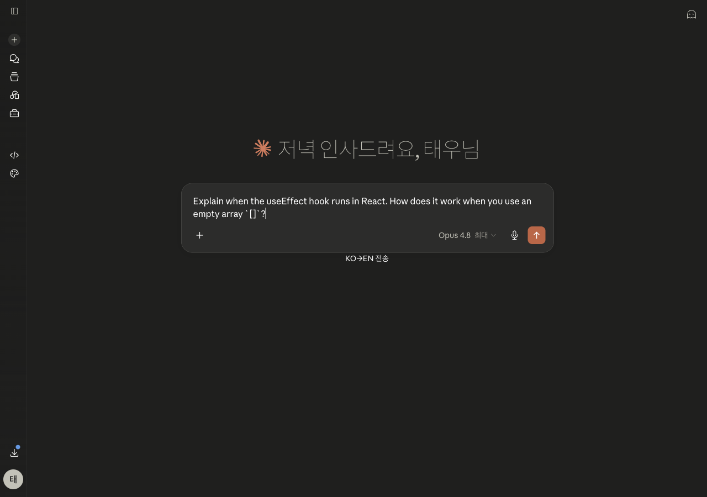

# Claude Korean Translator (KO↔EN) · claude.ai 한↔영 자동 번역

> **claude.ai에서 한국어로 쓰면 영어로 보내고, Claude의 영어 답변을 한국어로 보여주는 Chrome 확장.**
> 번역은 **본인 Anthropic API 키**로 **Claude Haiku**를 호출해 처리합니다 (BYOK). 제3 서버 경유 없음.

A Chrome extension that auto-translates your **claude.ai** prompts **Korean → English** before sending, and Claude's **English → Korean** replies inline — using **your own Anthropic API key** (Claude Haiku). Bring-your-own-key, no third-party server.



---

## ✨ 기능
- **입력 번역(KO→EN)**: 컴포저에 한국어로 쓰고 `KO→EN 전송` 버튼을 누르면 영어로 바꿔 전송.
- **출력 번역(EN→KO)**: Claude의 영어 응답 아래에 한국어 번역 블록을 자동 주입(토글 가능).
- **코드·마크다운 보존**: 코드 펜스/인라인 코드/링크/파일 경로는 그대로 두고 자연어만 번역.
- **지시·질문도 "번역"**: "~알려줘" 같은 프롬프트를 *답변*하지 않고 그대로 번역(프롬프트 인젝션 방어 포함).
- **BYOK·프라이버시**: 키는 브라우저 로컬 저장소에만, 텍스트는 `api.anthropic.com`으로만 전송.
- **on/off 토글**: 입력/출력 번역 각각 켜고 끌 수 있음.

## 🚀 설치 (개발자 모드 / unpacked)
1. 이 저장소를 다운로드하거나 클론합니다.
   ```bash
   git clone https://github.com/TaewoooPark/claude-korean-translator.git
   ```
2. Chrome에서 `chrome://extensions` 접속 → 우측 상단 **개발자 모드** 켜기.
3. **"압축해제된 확장 프로그램 로드"** → 이 폴더를 선택.
4. 확장 아이콘 → **설정 / API 키** → Anthropic API 키 입력 → **키 검증**.
5. [claude.ai](https://claude.ai) 접속 → 컴포저의 `KO→EN 전송` 버튼 사용. 응답엔 한국어 번역이 자동으로 붙습니다.

> Chrome은 Web Store 밖의 `.crx` 자동설치를 막으므로, 위 unpacked 방식으로 로드하세요.

## 🔑 Anthropic API 키 발급
1. [console.anthropic.com](https://console.anthropic.com) 가입/로그인.
2. **API Keys** → 새 키 생성 → `sk-ant-...` 복사 → 확장 설정에 입력.
3. 사용량만큼 본인 키로 과금됩니다(Haiku는 매우 저렴).
4. `401 ... CORS requests are not allowed for this Organization` 이 나오면, 콘솔의 조직 설정에서 **클라이언트/직접 브라우저 접근(CORS)** 을 허용하세요.

## 🔒 프라이버시
- API 키는 `chrome.storage.local`(이 브라우저의 확장 저장소)에만 저장되고, **background service worker만** 읽습니다.
- 입력/응답 텍스트는 오직 **`api.anthropic.com`** 으로만 전송됩니다. **제3 서버 없음.**
- 키·요청·응답 본문을 로깅하지 않습니다. MV3 원격 코드 없음(모든 코드 패키지 동봉).

## 🧩 동작 원리
```
claude.ai 탭                         확장 (격리 컨텍스트)
 content script  ──{text, dir}──▶   background service worker
  · 입력 가로채기                      · API 키 보관(유일)
  · 응답 감지/주입   ◀──{result}──     · Haiku 호출(fetch)
        │ DOM                                  │ fetch
        ▼                                      ▼
 claude.ai 페이지              api.anthropic.com /v1/messages
```
- `fetch`는 **background에서만** — content script는 claude.ai의 CSP에 묶여 직접 호출 불가.
- **API 키는 background에만** 존재, content script(페이지 컨텍스트)로 절대 전달하지 않음.
- claude.ai 컴포저는 **TipTap/ProseMirror** 에디터라, 텍스트 교체는 노출된 `editor.setContent()`(실제 문서 상태 갱신)를 사용해 안정적으로 반영.

## 🛠 개발 / 빌드
- 셀렉터/DOM 로직은 `content/claude-dom.js`에 집중(claude.ai UI 변동 시 이 파일만 패치). 실제 페이지에서 `CtxDOM.diagnose()` 로 셀렉터 상태 확인 가능.
- 릴리스 zip 빌드:
  ```bash
  ./scripts/build.sh   # claude-korean-translator-vX.Y.Z.zip 생성
  ```
- `test/` 에 claude.ai DOM 재현 픽스처 + 통합 하니스(실제 번역 왕복) 포함. 전체 검증 기록은 [`VERIFICATION.md`](VERIFICATION.md).

## ⚠️ 참고
- 본 확장은 **비공식**이며 Anthropic과 제휴 관계가 없습니다. claude.ai UI를 보조적으로 변형하는 클라이언트 도구입니다.
- claude.ai는 UI/클래스명이 자주 바뀌므로 셀렉터가 깨질 수 있습니다(`content/claude-dom.js` 패치로 대응).

## 📄 License
[MIT](LICENSE) © Taewoo Park

---

<p align="center">made by <b>Taewoo Park</b> · <a href="https://github.com/TaewoooPark">GitHub</a> · <a href="https://www.taewoopark.com/">Website</a></p>

<sub>keywords: claude, claude.ai, korean translator, 한영 번역, 클로드 번역, chrome extension, anthropic api, haiku, BYOK, prompt translation</sub>
