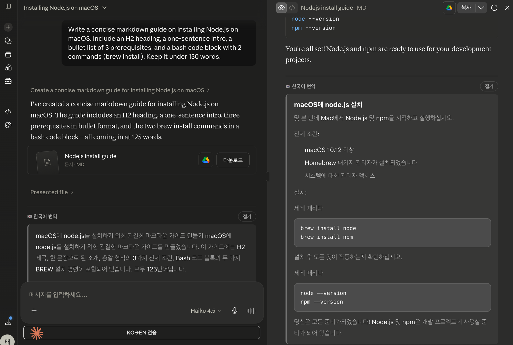

<h1 align="center">Claude Korean Translator · 한↔영</h1>

<p align="center">
  <strong>claude.ai에 한국어로 쓰고, Claude를 한국어로 읽고, 비용은 0.</strong><br>
  <em>한국어 프롬프트를 보내기 전에 KO→EN으로, Claude의 영어 답변을 EN→KO로 자동 번역하는 Chrome 확장 — 기본은 온디바이스·무료, 원하면 본인 Anthropic 키.</em>
</p>

<p align="center">
  
  
  
  
  &nbsp;
  
  
  
  
  
</p>

<p align="center">
  <a href="./README.en.md">English README</a>
</p>

---

<p align="center">
  
</p>
<p align="center"><sub>Claude의 영어 답변(아티팩트 포함)이 헤딩·목록·코드블록 그대로 한국어로 — 입력창엔 <b>KO→EN 전송</b> 버튼.</sub></p>

---

## 무엇을 하나

- **입력 (KO → EN).** 한국어로 프롬프트를 쓰고 주입된 **`KO→EN 전송`** 버튼을 누르면, 영어로 *그 자리에서* 번역되어 전송됩니다 — Claude가 가장 잘하는 언어로 추론하게.
- **출력 (EN → KO).** Claude의 영어 답변마다 아래에 접이식 **🇰🇷 한국어 번역** 블록이 붙습니다. 메시지별로 토글.
- **코드·마크다운 보존.** 코드펜스, 인라인 `code`, URL, 파일 경로는 번역하지 않습니다 — 아래 [코드 보존 방식](#코드-보존-방식--플레이스홀더-마스킹) 참고.
- **질문은 *번역*되지 *답변*되지 않음.** "LLM에게 번역시키기"식은 "useEffect 설명해줘"를 설명으로 바꿔버립니다. 이 확장은 절대 그러지 않습니다 — 번역기는 번역만 합니다.

---

## 두 가지 백엔드 — 취향대로

| | **Chrome 온디바이스** (기본) | **Anthropic API 키** (선택) |
|---|---|---|
| 비용 | **무료** | 본인 키·사용량 (Haiku — 수 원) |
| 설정 | 없음 — 모델 1회 다운로드 | `sk-ant-…` 키 입력 |
| 네트워크 | **기기 밖으로 안 나감** | `api.anthropic.com` 으로만 |
| 엔진 | Chrome 내장 `Translator`(온디바이스 NMT) | Claude Haiku |
| 품질 | KO↔EN 충분 | 뉘앙스 한 단계↑ |
| 코드 보존 | 플레이스홀더 마스킹 | 프롬프트 지시 + 마스킹 |

기본은 **온디바이스** — 비용·키 0, 오프라인 동작. 기존 **API 키 백엔드는 옵션으로 유지**되어, Haiku급 뉘앙스를 원하면 옵션에서 언제든 전환할 수 있습니다. 두 백엔드 모두 코드를 같은 방식으로 보호합니다.

> 온디바이스 엔진은 Chrome 내장 **Translator API**(온디바이스 신경망 번역, 현재 Chrome에 탑재)를 씁니다. 언어쌍을 처음 쓸 때 모델이 한 번 다운로드(수 초)되고, 이후엔 오프라인으로 영구 동작합니다. **출력 자동 번역**을 켜려면 옵션에서 **"모델 다운로드"** 를 한 번 눌러주세요.

---

## 코드 보존 방식 — 플레이스홀더 마스킹

기계번역 모델은 보이는 *모든 것*을 번역합니다. 그대로 두면 `useEffect`를 `UseEffect`로 바꾸고, 코드블록 안 주석을 번역하고, URL을 망가뜨립니다. Anthropic 백엔드는 프롬프트로 "건드리지 마"라고 *지시*할 수 있지만, 온디바이스 NMT엔 그런 손잡이가 없습니다. 그래서 번역기에 텍스트를 넘기기 전에 [`lib/code-mask.js`](lib/code-mask.js)가 자연어가 아닌 모든 것을 보호하고, 번역 후 그대로 복원합니다. **2단계:**

**1 — 코드펜스는 통째로 분리.** ` ``` … ``` ` 사이의 내용은 번역 스트림에서 빼내 줄바꿈까지 바이트 단위로 보존하고, 정확히 같은 위치에 다시 끼웁니다. 모델이 아예 못 봅니다.

**2 — 인라인 스팬은 센티넬 플레이스홀더로 치환.** 남은 프로즈에서 인라인 `` `code` ``, URL, 이메일, 파일 경로를 MT가 확실히 그대로 통과시키는 희귀 수학 괄호 토큰 **`⟦0⟧ ⟦1⟧ …`** 으로 바꿉니다. 번역 후 원본으로 되돌립니다.

```text
입력    리액트에서 useEffect 훅을 설명해줘. `useEffect(() => {}, [])` 참고: https://react.dev
마스킹  리액트에서 useEffect 훅을 설명해줘. ⟦0⟧ 참고: ⟦1⟧
        → 온디바이스 번역 →
        Explain the useEffect hook in React. ⟦0⟧ Reference: ⟦1⟧
출력    Explain the useEffect hook in React. `useEffect(() => {}, [])` Reference: https://react.dev
```

보호 대상: ` ```펜스``` ` 블록 · 인라인 `` `code` `` · `https://…` URL · `name@host` 이메일 · `./경로/파일.확장자`, `/usr/bin`, `C:\…` 경로. 결과적으로 내 코드는 쓴 그대로 Claude에게 가고, Claude의 코드는 그대로 돌아옵니다 — 주변 자연어만 언어가 바뀝니다.

---

## 설치 (압축해제 / unpacked)

1. 코드 받기 — 최신 [릴리스 zip](https://github.com/TaewoooPark/claude-korean-translator/releases) 또는 클론:
   ```bash
   git clone https://github.com/TaewoooPark/claude-korean-translator.git
   ```
2. Chrome → `chrome://extensions` → 우측 상단 **개발자 모드** 켜기.
3. **"압축해제된 확장 프로그램 로드"** → 확장 폴더 선택.
4. 확장 **옵션** 열기. 기본 백엔드는 **Chrome 온디바이스** — **"모델 다운로드 / 확인"** 한 번 클릭. (또는 **Anthropic API 키** 로 전환 후 키 입력.)
5. [claude.ai](https://claude.ai) 접속 → **`KO→EN 전송`** 버튼 사용. 응답엔 한국어 블록이 자동으로 붙습니다.

> Chrome은 Web Store 밖의 `.crx` 자동설치를 막으므로, 위 압축해제 방식으로 로드하세요.

---

## 동작 원리

```
claude.ai 탭                                  확장
 ┌───────────────────────────┐               ┌──────────────────────────┐
 │ content script            │  backend =    │ service worker (Anthropic│
 │  · KO→EN 버튼 + 옵저버      │  "anthropic"  │  백엔드일 때만)           │
 │  · code-mask + 번역        │ ────────────▶ │  · API 키 보관(유일)      │
 │  · editor.setContent      │ ◀──────────── │  · Haiku 호출(fetch)      │
 │                           │   {result}    └──────────────────────────┘
 │  backend = "chrome":      │
 │  온디바이스 Translator ───▶ 로컬 번역, 네트워크·키 없음
 └───────────────────────────┘
```

- **온디바이스 백엔드**는 콘텐츠 스크립트 안에서 전부 처리: `Translator` → 번역 → 마스크 복원. 아무 데도 전송하지 않음.
- **Anthropic 백엔드**는 텍스트를 서비스워커로 보내고, API 키는 *오직* 거기에만 존재(페이지로 노출 안 됨).
- claude.ai 컴포저는 **TipTap/ProseMirror** 에디터라, 텍스트를 `editor.setContent()` 로 기록해 실제 문서 상태를 갱신(DOM만 바꾸면 claude.ai draft 복원에 되돌려짐).

---

## 프라이버시

- **온디바이스:** 텍스트가 기기를 떠나지 않음. 키·서버·텔레메트리 없음.
- **Anthropic:** 텍스트는 `api.anthropic.com` 으로만, 본인 키로 과금. 키는 `chrome.storage.local`에 저장되고 서비스워커만 읽음.
- 원격 코드 없음(MV3, 전부 동봉). 로깅 없음.

---

## 빌드 & 개발

```bash
./scripts/build.sh        # → claude-korean-translator-vX.Y.Z.zip (확장 파일만 포함)
```

- claude.ai의 난독화된 DOM은 `content/claude-dom.js`에 모아둠. UI 변동 시 페이지 콘솔에서 `CtxDOM.diagnose()` 로 셀렉터 상태 확인.
- `test/` 에 claude.ai DOM 픽스처 + 통합 하니스(실제 왕복). 전체 검증 기록: [`VERIFICATION.md`](VERIFICATION.md).

## 참고

- 비공식이며 Anthropic과 제휴 없음. 본인 세션에서 동작하는 클라이언트 보조 도구.
- claude.ai는 UI를 자주 바꿉니다 — 셀렉터가 깨지면 `content/claude-dom.js` 패치.
- 온디바이스 엔진은 내장 Translator API가 있는 최신 Chrome 필요. 아니면 Anthropic 백엔드로 전환.

---

## Connect

<p align="center">
  <a href="https://github.com/TaewoooPark"></a>
  <a href="https://www.taewoopark.com/"></a>
  <a href="https://x.com/theoverstrcture"></a>
  <a href="https://www.linkedin.com/in/taewoo-park-427a05352"></a>
  <a href="https://www.instagram.com/t.wo0_x/"></a>
</p>

---

## License

[MIT](LICENSE) © Taewoo Park

---

<p align="center">
  <em>입력창엔 한국어, 전송은 영어, 화면엔 다시 한국어 — 그리고 코드는 처음부터 끝까지 그대로.</em>
</p>

<sub>keywords: claude, claude.ai, korean translator, 한영 번역, 클로드 번역, 클로드 한국어, chrome extension, 온디바이스 번역, chrome 내장 AI, translator api, anthropic, haiku, BYOK</sub>
